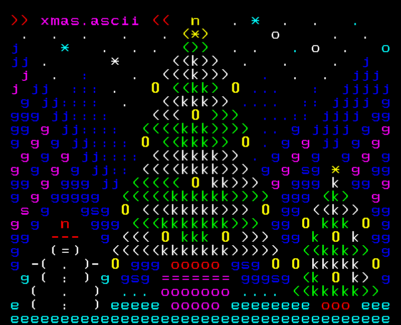

<!-- PROJECT SHIELDS -->

<!-- PROJECT LOGO -->

 

    
    <h3 align="center">Advent of Code</h3>
    

        Better than chocolates
    

<!-- ABOUT THE PROJECT -->

## About

> Advent of Code is an advent calendar of small programming puzzles for a variety of skill sets and skill levels that can be solved in any programming language you like.
>
> &mdash; Eric Wastl

This repository gathers all my participations throughout the different edition of the [Advent of Code](https://adventofcode.com/) event.

My entries are not further optimized after completion, as I want them to reflect how I approach problems and write code on the fly. However, I try to always provide a solution that can produce the desired output in a reasonable amount of time.

<a href="#top"><i>back to top</i></a>

<!-- YEARS -->

## Years

    <a href="https://adventofcode.com/2023">2023</a>

<table>
    <thead>
        <tr>
            <th rowspan="2">Day</th>
            <th rowspan="2">Problem name</th>
            <th colspan="2">Completion</th>
            <th colspan="2">Execution time (s)</th>
        </tr>
        <tr>
            <th>Part 1</th>
            <th>Part 2</th>
            <th>Part 1</th>
            <th>Part 2</th>
        </tr>
    </thead>
    <tbody>
        <tr>
            <td>1</td>
            <td><a href="https://adventofcode.com/2023/day/1">Trebuchet?!</a></td>
            <td>✅</td>
            <td>✅</td>
            <td>0.046</td>
            <td>0.048</td>
        </tr>
        <tr>
            <td>2</td>
            <td><a href="https://adventofcode.com/2023/day/2">Cube Conundrum</a></td>
            <td>✅</td>
            <td>✅</td>
            <td>0.045</td>
            <td>0.046</td>
        </tr>
        <tr>
            <td>3</td>
            <td><a href="https://adventofcode.com/2023/day/3">Gear Ratios</a></td>
            <td>✅</td>
            <td>✅</td>
            <td>0.085</td>
            <td>0.075</td>
        </tr>
        <tr>
            <td>4</td>
            <td><a href="https://adventofcode.com/2023/day/4">Scratchcards</a></td>
            <td>✅</td>
            <td>✅</td>
            <td>0.045</td>
            <td>0.046</td>
        </tr>
        <tr>
            <td>5</td>
            <td><a href="https://adventofcode.com/2023/day/5">If You Give A Seed A Fertilizer</a></td>
            <td>✅</td>
            <td>✅</td>
            <td>0.046</td>
            <td>628.044</td>
        </tr>
        <tr>
            <td>6</td>
            <td><a href="https://adventofcode.com/2023/day/6">Wait For It</a></td>
            <td>✅</td>
            <td>✅</td>
            <td>0.044</td>
            <td>6.894</td>
        </tr>
        <tr>
            <td>7</td>
            <td><a href="https://adventofcode.com/2023/day/7">Camel Cards</a></td>
            <td>✅</td>
            <td>✅</td>
            <td>0.065</td>
            <td>0.066</td>
        </tr>
        <tr>
            <td>8</td>
            <td><a href="https://adventofcode.com/2023/day/8">Haunted Wasteland</a></td>
            <td>✅</td>
            <td>✅</td>
            <td>0.127</td>
            <td>0.601</td>
        </tr>
        <tr>
            <td>9</td>
            <td><a href="https://adventofcode.com/2023/day/9">Mirage Maintenance</a></td>
            <td>✅</td>
            <td>✅</td>
            <td>0.050</td>
            <td>0.051</td>
        </tr>
        <tr>
            <td>10</td>
            <td><a href="https://adventofcode.com/2023/day/10">Pipe Maze</a></td>
            <td>✅</td>
            <td>✅</td>
            <td>0.060</td>
            <td>0.067</td>
        </tr>
        <tr>
            <td>11</td>
            <td><a href="https://adventofcode.com/2023/day/11">Cosmic Expansion</a></td>
            <td>✅</td>
            <td>✅</td>
            <td>0.085</td>
            <td>0.086</td>
        </tr>
        <tr>
            <td>12</td>
            <td><a href="https://adventofcode.com/2023/day/12">Hot Springs</a></td>
            <td>✅</td>
            <td>✅</td>
            <td>3.814</td>
            <td>3.169</td>
        </tr>
        <tr>
            <td>13</td>
            <td><a href="https://adventofcode.com/2023/day/13">Point of Incidence</a></td>
            <td>✅</td>
            <td>✅</td>
            <td>0.060</td>
            <td>0.069</td>
        </tr>
        <tr>
            <td>14</td>
            <td><a href="https://adventofcode.com/2023/day/14">Parabolic Reflector Dish</a></td>
            <td>✅</td>
            <td>✅</td>
            <td>0.060</td>
            <td>5.754</td>
        </tr>
        <tr>
            <td>15</td>
            <td><a href="https://adventofcode.com/2023/day/15">Lens Library</a></td>
            <td>✅</td>
            <td>✅</td>
            <td>0.045</td>
            <td>0.051</td>
        </tr>
        <tr>
            <td>16</td>
            <td><a href="https://adventofcode.com/2023/day/16">The Floor Will Be Lava</a></td>
            <td>✅</td>
            <td>✅</td>
            <td>1.241</td>
            <td>8.625</td>
        </tr>
        <tr>
            <td>17</td>
            <td><a href="https://adventofcode.com/2023/day/17">Clumsy Crucible</a></td>
            <td>❌</td>
            <td>❌</td>
            <td></td>
            <td></td>
        </tr>
        <tr>
            <td>18</td>
            <td><a href="https://adventofcode.com/2023/day/18">Lavaduct Lagoon</a></td>
            <td>✅</td>
            <td>✅</td>
            <td>0.048</td>
            <td>0.050</td>
        </tr>
        <tr>
            <td>19</td>
            <td><a href="https://adventofcode.com/2023/day/19">Aplenty</a></td>
            <td>✅</td>
            <td>❌</td>
            <td>0.065</td>
            <td></td>
        </tr>
        <tr>
            <td>20</td>
            <td><a href="https://adventofcode.com/2023/day/20">Pulse Propagation</a></td>
            <td>❌</td>
            <td>❌</td>
            <td></td>
            <td></td>
        </tr>
        <tr>
            <td>21</td>
            <td><a href="https://adventofcode.com/2023/day/21">Step Counter</a></td>
            <td>❌</td>
            <td>❌</td>
            <td></td>
            <td></td>
        </tr>
        <tr>
            <td>22</td>
            <td><a href="https://adventofcode.com/2023/day/22">Sand Slabs</a></td>
            <td>❌</td>
            <td>❌</td>
            <td></td>
            <td></td>
        </tr>
        <tr>
            <td>23</td>
            <td><a href="https://adventofcode.com/2023/day/23">A Long Walk</a></td>
            <td>❌</td>
            <td>❌</td>
            <td></td>
            <td></td>
        </tr>
        <tr>
            <td>24</td>
            <td><a href="https://adventofcode.com/2023/day/24">Never Tell Me The Odds</a></td>
            <td>❌</td>
            <td>❌</td>
            <td></td>
            <td></td>
        </tr>
        <tr>
            <td>25</td>
            <td><a href="https://adventofcode.com/2023/day/25">Snowverload</a></td>
            <td>❌</td>
            <td>❌</td>
            <td></td>
            <td></td>
        </tr>
    </tboby>
</table>

<a href="#top"><i>back to top</i></a>

<!-- LICENSE -->

## License

Distributed under the CC0 1.0 Universal License. See `LICENSE` for more information.

<a href="#top"><i>back to top</i></a>

